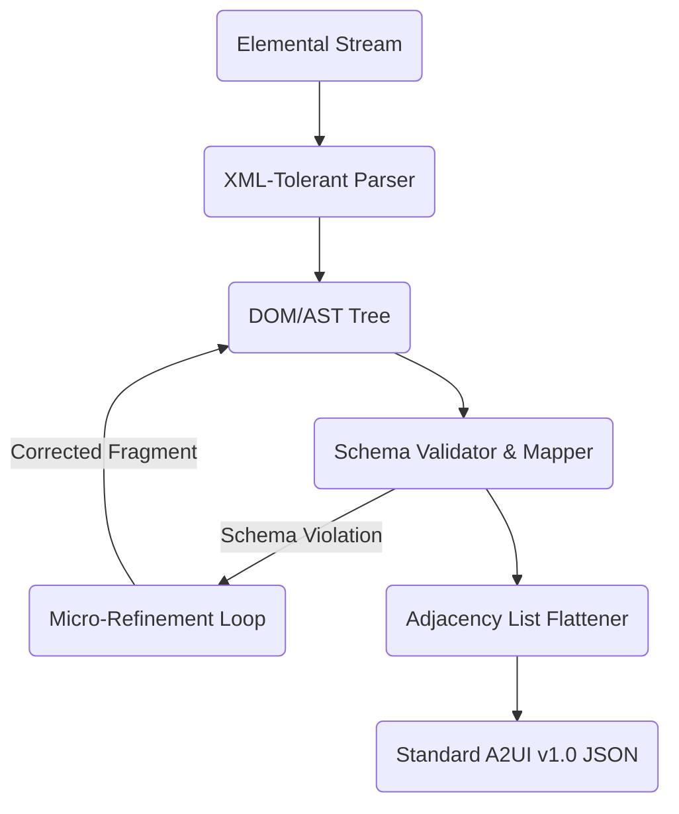

# A2UI Elemental technical specification

A2UI Elemental is a model-optimized declarative user interface format that uses plain HTML5-like markup (without custom JavaScript or CSS) as the inference format, and Web Components (Custom Elements) to describe and specify catalog components.

By using the web's native markup structure, A2UI Elemental minimizes model system instruction overhead, increases token efficiency, and exploits the pre-training of LLMs on HTML/XML structures. A host-side compiler parses this HTML stream and compiles it into standard A2UI v1.0 wire protocol payloads.

---

## Core design goals

- **Model alignment**: LLMs are proficient at generating HTML. Using standard HTML syntax reduces the system prompt size needed to instruct the model on how to generate user interfaces.
- **Token efficiency**: Common HTML tags, attributes, and self-closing tags are optimized in modern LLM tokenizers (often represented as single tokens), resulting in lower token usage compared to JSON or custom DSLs.
- **Natural hierarchical nesting**: HTML’s native tree structure eliminates the need for manual layout referencing (e.g., `"child": "component_id"`) in the generated output. The compiler handles the flattening to A2UI's adjacency-list format.
- **Self-describing structure**: By using named attributes and slots, A2UI Elemental avoids the need for complex positional-to-named schema mapping tables (which are required by positional DSLs like A2UI Express), simplifying the compiler implementation.
- **Incremental streaming**: HTML is streamable. The compiler can parse the incoming HTML token stream incrementally using an XML-tolerant or custom streaming parser, enabling progressive UI rendering.
- **Catalog reuse**: The compiler retains the existing A2UI JSON Schema catalog format as the source of truth, translating it to HTML element signatures when building the model's system prompt.

---

## Syntax and grammar

A2UI Elemental UI blocks are enclosed in standard `<body>` tags:

```html
<body id="notification-card">
  <!-- Optional catalog definition:
  <link rel="catalog" href="https://a2ui.org/specification/v1_0/catalogs/basic/catalog.json" />
  -->
  <!-- UI components go here -->
</body>
```

- The `id` attribute on `<body>` maps to the `surfaceId` in the `createSurface` payload.
- The `<link rel="catalog">` tag is optional. Its `href` attribute maps to the `catalogId`. If omitted, the compiler defaults to its pre-configured catalog.

### Component declarations

Catalog components are represented by custom HTML elements. Tag names are prefixed with `ui-` and correspond to the component name in lowercase kebab-case (e.g., `Card` becomes `<ui-card>`, `TextInput` becomes `<ui-text-input>`).

- **Component identifiers**: To ensure 100% round-trip fidelity, components preserve their `id` attributes (e.g., `<ui-button id="comp_0">`). The compiler maps this directly to the component's `id` in the JSON payload. If omitted, the compiler auto-generates a unique ID.
- **Attributes and properties**: Standard string properties are passed as regular attributes. Typed literals (numbers, booleans, and null) are passed using JSX-style curly braces enclosed in double quotes:
  ```html
  <ui-card id="card_1" elevation="{4}" disabled="{true}">...</ui-card>
  ```
- **Option object auto-expansion**: If a component property expects a list of option objects containing `label` and `value` properties (such as a dropdown or radio group), but the input is a list of strings, the compiler automatically expands each string into an object:
  ```html
  <ui-dropdown id="color_select" options="{['Red', 'Green', 'Blue']}" />
  ```
  This compiles to the standard JSON structure:
  ```json
  [
    {
      "id": "color_select",
      "component": "Dropdown",
      "options": [
        {"label": "Red", "value": "Red"},
        {"label": "Green", "value": "Green"},
        {"label": "Blue", "value": "Blue"}
      ]
    }
  ]
  ```
- **Self-closing tags**: Supported and preferred for leaf components or components without children:
  ```html
  <ui-icon id="icon_1" name="check" />
  ```
- **Text nodes**: Text nodes are not auto-wrapped. If a component expects a child component (e.g., the `child` property of a `Button`), the child must be declared explicitly:
  ```html
  <ui-button id="btn_1">
    <ui-text id="txt_1" text="Click Me" />
  </ui-button>
  ```

### Data binding and reactive paths

To connect properties or text to the application's shared data model, we use the `$` path prefix wrapped in curly braces `{...}`.

- **Path bindings**:
  - Absolute paths: `$/path/to/value` (e.g., `name="{$/icon}"`, `{$/title}`)
  - Relative paths (within lists): `$path/to/value` (e.g., `{$name}`)
- **Expression grammar**: Expressions inside curly braces `{...}` support path bindings, typed literals, nested function calls, array literals, and object literals:
  - **Array literals** are enclosed in square brackets `[...]` (e.g., `checks="{[required(), customCheck(val: 10)]}"`).
  - **Object literals** are enclosed in curly braces `{...}` and contain key-value pairs. If the entire attribute value is an object literal, it results in a double curly brace `{{...}}` pattern (e.g., `context="{{id: 123, user: $/user/name}}"`).
  - _Example_:
    ```html
    <ui-text id="txt_1" text="{formatCurrency(value: $/order/total, currency: 'USD')}" />
    ```
- **Nested function calls**: Functions can be nested arbitrarily as arguments:
  ```html
  <ui-text id="txt_2" text="{myFunc(a: otherFunc(x: $/path), b: 'literal value')}" />
  ```
- **Type resolution and casting**:
  - The compiler automatically infers the `returnType` of a function by looking it up in the `FunctionCatalog` during compilation.
  - For custom or uncataloged functions, or to override inference, an optional type cast can be appended using the `as` keyword:
    ```html
    <ui-text id="txt_3" text="{customFunc(x: 1) as string}" />
    ```
- **Mixed text**: Mixed text (e.g., `Welcome, {$/user/firstName}!`) is not allowed in text nodes or attributes. If a catalog supports a string interpolation function (like `formatString`), it must be invoked explicitly:
  ```html
  <ui-text id="txt_4" text="{formatString(value: 'Welcome, ${/user/firstName}!')}" />
  ```

### Children and slots

The compiler maps nested child elements to the properties of the underlying A2UI component using HTML slots:

- By default, children map to the component's primary slot (e.g., `child` or `children` based on the catalog schema).
- For components with multiple layout areas or child properties, the `slot` attribute is used:
  ```html
  <ui-split-view id="split_1">
    <ui-card id="card_left" slot="leading">...</ui-card>
    <ui-card id="card_right" slot="trailing">...</ui-card>
  </ui-split-view>
  ```

### Complex object properties

Some advanced components require complex, structured JSON objects for configuration (e.g., table column definitions, chart datasets, or map layers). To avoid quote-escaping issues in attributes, complex properties are passed via a standard `<script type="application/json">` element placed in a named slot matching the property name:

```html
<ui-table id="table_1">
  <script type="application/json" slot="columns">
    [
      {"key": "name", "label": "Name"},
      {"key": "age", "label": "Age"}
    ]
  </script>
</ui-table>
```

The compiler parses the text content of the script tag strictly as JSON, throwing a compilation error if it contains invalid JSON.

### Structural lists and templates

When rendering dynamic lists (where a template is repeated for each item in a collection), we use a nested `<template>` element:

```html
<ui-list id="list_1" path="{$/breeds}">
  <template>
    <ui-text id="item_txt" text="{$name}" />
  </template>
</ui-list>
```

- The `path` attribute specifies the list data source.
- The `<template>` tag contains the component structure to instantiate for each item.
- Relative paths (like `{$name}`) resolve within the list item's context.
- To reference the iteration index, use `{@index}` (with optional arguments like `{@index(offset: 1)}`).
- When iterating over a list of primitive types (e.g., strings), use `{$this}` (or `{$.}`) to reference the current item itself.

### Form validation

Validation rules leverage standard HTML5 validation attributes where possible, supplemented by custom attributes and the `checks` attribute for advanced logic:

```html
<ui-text-input
  id="input_1"
  required
  pattern="^[0-9]{5}$"
  error-message="Must be a valid 5-digit zip code"
/>
```

For advanced or custom validation functions defined in the catalog (such as age validation or cross-field validation), the `checks` attribute accepts an array of function calls:

```html
<ui-text-input
  id="dob"
  error-message="You must be at least 18 years old"
  checks="{[required(), isAdult(birthDate: $/dob)]}"
/>
```

- **Implicit value injection**: If a validation function's first parameter is `value` (e.g., `required(value)` or `email(value)`), the compiler automatically injects the parent component's `value` path if it is omitted in the call (as shown in `required()` above).
- **No inline messages**: The functions inside the `checks` attribute only specify validation conditions. Error messaging is handled via the component's top-level `error-message` attribute or the renderer's default messages.

The compiler translates this array into the standard `checks` array of `FunctionCall` objects in the component's JSON payload.

### Actions and event handling

Actions and events are declared using event-like attributes and curly braces. The compiler dynamically generates a bi-directional mapping table for each component based on its JSON Schema:

1. The compiler scans the component's schema properties for any field referencing the `Action` type (`common_types.json#/$defs/Action`).
2. The canonical HTML attribute is `on-<property-name>` in kebab-case (e.g., `submitAction` becomes `on-submit-action`, `onChanged` becomes `on-changed`). If a component has only a single `Action` property, `onclick` is registered as an accepted alias.
3. The decompiler always outputs the canonical HTML attribute (or `onclick` if it is the sole action).

Here is an example triggering a server event:

```html
<ui-button id="btn_1" onclick="{Event('accept', {id: 123})}">
  <ui-text id="txt_btn_1" text="Yes" />
</ui-button>
```

Here is an example calling a client function:

```html
<ui-button id="btn_2" onclick="{openUrl(url: 'https://example.com')}">
  <ui-text id="txt_btn_2" text="Learn More" />
</ui-button>
```

### Standalone operations

If the model needs to perform a lifecycle operation or invoke an RPC function without rendering a UI surface, it uses specialized top-level tags:

- Deleting a surface:
  ```html
  <ui-delete-surface id="del_1" surface-id="dashboard-surface-1" />
  ```
- Calling a client function:
  ```html
  <ui-call-function id="call_1" name="openUrl" url="https://example.com" want-response="{true}" />
  ```
  This maps to the v1.0 `CallFunctionMessage`. The `id` attribute maps to `functionCallId` (auto-generated if omitted), and `want-response` maps to `wantResponse`.

---

## Data model population

To populate or initialize values within the shared data model directly from the generated output, A2UI Elemental uses a `<script type="application/json">` element containing a single, pure JSON object at the root level of the `<body>`:

```html
<body id="notification-card">
  <!-- Optional catalog definition:
  <link rel="catalog" href="https://a2ui.org/specification/v1_0/catalogs/basic/catalog.json" />
  -->
  <script type="application/json">
    {
      "icon": "check",
      "title": "Enable notification",
      "description": "Would you like to receive updates?"
    }
  </script>
  <ui-card id="comp_0">...</ui-card>
</body>
```

The compiler parses this JSON and includes it in the `dataModel` field of the resulting `createSurface` payload. If the document contains only the script block and no UI elements, the compiler produces a standalone `updateDataModel` protocol message.

---

## Ecosystem integration

A2UI Elemental is completely catalog-agnostic. The compiler does not hold hardcoded assumptions about component names, function signatures, or properties.

### Automated catalog-to-prompt utility

To instruct the model on the available components and their properties, a host-side utility compiles the active JSON schema catalog into **TypeScript TSX/JSX type definitions**.

Because LLMs are highly proficient at TypeScript and React/JSX, providing the catalog as TSX declarations in the system prompt results in highly accurate code generation:

```typescript
interface CardProps {
  id: string;
  elevation?: number;
  disabled?: boolean;
  child?: A2UIElement;
}
/**
 * Renders a card container.
 * @element ui-card
 */
declare const Card: React.FC<CardProps>;

interface TextInputProps {
  id: string;
  value?: string | DataBinding;
  placeholder?: string;
  required?: boolean;
  pattern?: string;
  errorMessage?: string;
  checks?: FunctionCall[];
}
/**
 * A text input field.
 * @element ui-text-input
 */
declare const TextInput: React.FC<TextInputProps>;
```

During inference, the model generates standard HTML elements matching these signatures, which the compiler maps back to the JSON wire protocol.

---

## Compilation pipeline



### Error recovery and micro-refinement

Because HTML parsers are forgiving, syntax errors are rarely fatal. However, semantic schema violations (e.g., unknown tags, invalid attributes) are handled via a micro-refinement loop:

1. The compiler flags the invalid element/attribute and isolates the sub-branch of the DOM.
2. A tiny correction prompt containing the invalid HTML fragment and the schema validation error is sent to a fast, low-latency model.
3. The corrected fragment returned by the model is hot-swapped back into the DOM tree before finalizing the A2UI JSON payload.

---

## Compilation example

### Input HTML stream

```html
<body id="dashboard-surface">
  <!-- Optional catalog definition:
  <link rel="catalog" href="https://a2ui.org/specification/v1_0/catalogs/basic/catalog.json" />
  -->
  <script type="application/json">
    {
      "user": {
        "name": "Jane Doe",
        "balance": 1250.5
      },
      "transactions": [
        {"id": "t1", "amount": -50.0, "description": "Grocery Store"},
        {"id": "t2", "amount": 1200.0, "description": "Payroll"}
      ]
    }
  </script>
  <ui-card id="comp_0" elevation="{4}">
    <ui-column id="comp_1" align="center">
      <ui-text
        id="comp_2"
        variant="h3"
        text="{formatString(value: 'Welcome back, ${/user/name}!')}"
      />
      <ui-text
        id="comp_3"
        variant="body"
        text="{formatString(value: 'Your balance is: ${formatCurrency(value: /user/balance, currency:
        'USD')}')}"
      />
      <ui-table id="comp_4">
        <script type="application/json" slot="columns">
          [
            {"key": "description", "label": "Description"},
            {"key": "amount", "label": "Amount"}
          ]
        </script>
        <ui-list id="comp_5" slot="rows" path="{$/transactions}">
          <template>
            <ui-row id="comp_6">
              <ui-text id="comp_7" text="{$description}" />
              <ui-text id="comp_8" text="{formatCurrency(value: $amount, currency: 'USD')}" />
            </ui-row>
          </template>
        </ui-list>
      </ui-table>
      <ui-button id="comp_9" onclick="{Event('refresh')}">
        <ui-text id="comp_10" text="Refresh" />
      </ui-button>
    </ui-column>
  </ui-card>
</body>
```

### Compiled A2UI JSON output

```json
{
  "version": "v1.0",
  "createSurface": {
    "surfaceId": "dashboard-surface",
    "catalogId": "https://a2ui.org/specification/v1_0/catalogs/basic/catalog.json",
    "dataModel": {
      "user": {
        "name": "Jane Doe",
        "balance": 1250.5
      },
      "transactions": [
        {"id": "t1", "amount": -50.0, "description": "Grocery Store"},
        {"id": "t2", "amount": 1200.0, "description": "Payroll"}
      ]
    },
    "components": [
      {
        "id": "comp_0",
        "component": "Card",
        "elevation": 4,
        "child": "comp_1"
      },
      {
        "id": "comp_1",
        "component": "Column",
        "align": "center",
        "children": ["comp_2", "comp_3", "comp_4", "comp_9"]
      },
      {
        "id": "comp_2",
        "component": "Text",
        "variant": "h3",
        "text": {
          "call": "formatString",
          "args": {
            "value": "Welcome back, ${/user/name}!"
          },
          "returnType": "string"
        }
      },
      {
        "id": "comp_3",
        "component": "Text",
        "variant": "body",
        "text": {
          "call": "formatString",
          "args": {
            "value": "Your balance is: ${formatCurrency(value: /user/balance, currency: 'USD')}"
          },
          "returnType": "string"
        }
      },
      {
        "id": "comp_4",
        "component": "Table",
        "columns": [
          {"key": "description", "label": "Description"},
          {"key": "amount", "label": "Amount"}
        ],
        "rows": "comp_5"
      },
      {
        "id": "comp_5",
        "component": "List",
        "path": {
          "path": "/transactions"
        },
        "template": ["comp_6"]
      },
      {
        "id": "comp_6",
        "component": "Row",
        "children": ["comp_7", "comp_8"]
      },
      {
        "id": "comp_7",
        "component": "Text",
        "text": {
          "path": "description"
        }
      },
      {
        "id": "comp_8",
        "component": "Text",
        "text": {
          "call": "formatCurrency",
          "args": {
            "value": {"path": "amount"},
            "currency": "USD"
          },
          "returnType": "string"
        }
      },
      {
        "id": "comp_9",
        "component": "Button",
        "action": {
          "event": {
            "name": "refresh",
            "context": {}
          }
        },
        "child": "comp_10"
      },
      {
        "id": "comp_10",
        "component": "Text",
        "text": "Refresh"
      }
    ]
  }
}
```
