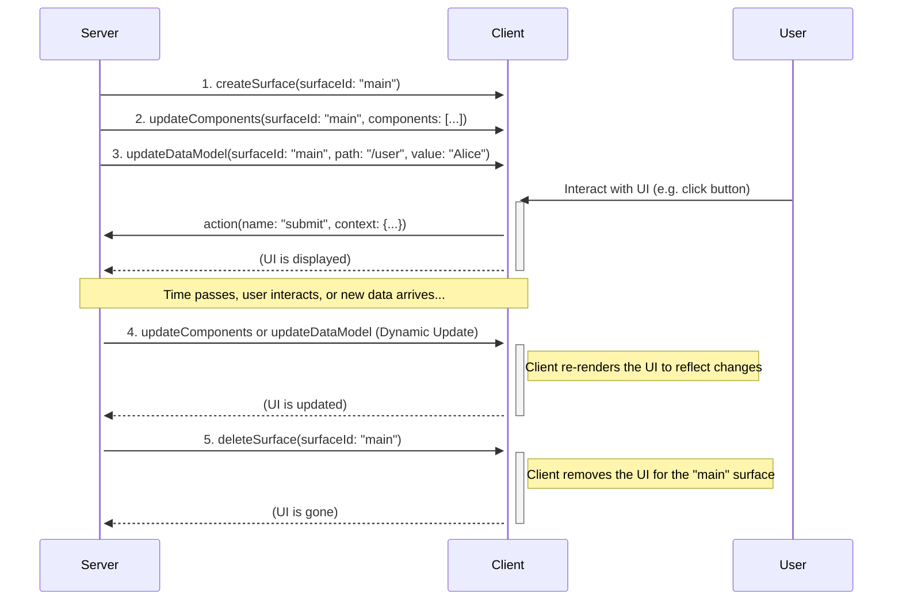
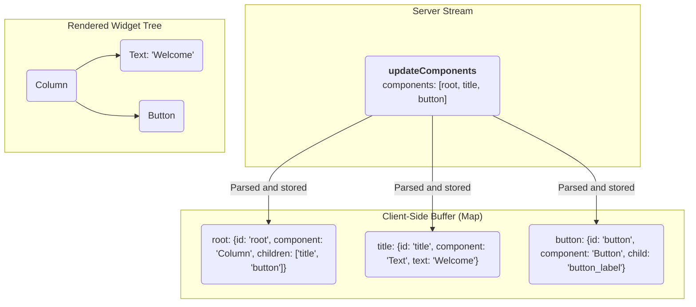

<!-- markdownlint-disable MD041 -->
<!-- markdownlint-disable MD033 -->
<!-- markdownlint-disable MD034 -->
<div style="text-align: center;">
  <div class="centered-logo-text-group">
    
    <h1>A2UI (Agent to UI) Protocol v1.0</h1>
  </div>
</div>

A Specification for a JSON-Based, Streaming UI Protocol.

**Version:** 1.0
**Status:** Candidate
**Created:** Nov 20, 2025
**Last Updated:** Jun 8, 2026

A Specification for a JSON-Based, Streaming UI Protocol

## Introduction

The A2UI Protocol is designed for dynamically rendering user interfaces from a stream of JSON objects sent from an agent. Its core philosophy emphasizes a clean separation of UI structure and application data, enabling progressive rendering as the renderer processes each message.

Communication occurs via a stream of JSON objects. The renderer parses each object as a distinct message and incrementally builds or updates the UI. The agent-to-renderer protocol defines four message types:

- `createSurface`: Signals the renderer to create a new surface and begin rendering it.
- `updateComponents`: Provides a list of component definitions to be added to or updated in a specific surface.
- `updateDataModel`: Provides new data to be inserted into or to replace a surface's data model.
- `deleteSurface`: Explicitly removes a surface and its contents from the UI.

End of agent turn is signaled by [transport layer](https://github.com/a2ui-project/a2ui/tree/main/docs/public/concepts/transports.md).

## Changes from previous versions

The major differences between version 1.0 and 0.9 (including 0.9.1) are:

- **Bidirectional RPC Messaging**: Supports synchronous server responses to client actions (`actionResponse`) and remote server-initiated function execution (`callFunction` / `functionResponse`) verified against runtime catalog definitions.
- **Single-Message UI Instantiation**: Allows initial component trees and data models to be embedded directly within `createSurface`, enabling complete UI composition in a single payload.
- **Decoupled Branding**: Replaces rigid theme properties with extensible `surfaceProperties` (removing hardcoded brand colors) to defer visual styling entirely to the target framework's native theme.
- **Enhanced Catalog Schemas**: Refactors function definitions into object maps for direct O(1) lookups and supports standard JSON Schema metadata fields (`$schema`, `$id`) on inline catalogs.
- **Strict Identifier & Context Standards**: Enforces Unicode (UAX #31) naming rules across all catalog entities and reserves the `@` namespace for universal system context evaluations (such as `@index`).

See [the evolution guide](evolution_guide.md) for a detailed explanation of the differences between v0.9 and v1.0.

## Protocol overview & data flow

The A2UI protocol uses a unidirectional stream of JSON messages from the server to the client to describe and update the UI. The client consumes this stream, builds the UI, and renders it. User interactions are handled separately, typically by sending events to a different endpoint, which may in turn trigger new messages on the UI stream.

Here is an example sequence of events (which don't have to be in exactly this order):

1.  **Create Surface:** The server sends a `createSurface` message to initialize the surface.
2.  **Update Surface:** Once a surface has been created, the server sends one or more `updateComponents` messages containing the definitions for all the components that will be part of the surface.
3.  **Update Data Model:** Once a surface has been created, the server can send `updateDataModel` messages at any time to populate or change the data that the UI components will display.
4.  **Render:** The client renders the UI for the surface, using the component definitions to build the structure and the data model to populate the content.
5.  **Dynamic updates:** As the user interacts with the application or as new information becomes available, the server can send additional `updateComponents` and `updateDataModel` messages to dynamically change the UI.
6.  **Delete Surface:** When a UI region is no longer needed, the server sends a `deleteSurface` message to remove it.



## Transport decoupling

The A2UI protocol is designed to be transport-agnostic. It defines the JSON message structure and the semantic contract between the server (Agent) and the client (Renderer), but it does not mandate a specific transport layer.

### The transport contract

To support A2UI, a transport layer must fulfill the following contract:

1.  **Reliable delivery**: Messages must be delivered in the order they were generated. A2UI relies on stateful updates (e.g., creating a surface before updating it), so out-of-order delivery can corrupt the UI state.
2.  **Message framing**: The transport must clearly delimit individual JSON envelope messages (e.g., using newlines in JSONL, WebSocket frames, or SSE events).
3.  **Metadata support**: The transport must provide a mechanism to associate metadata with messages. This is critical for:
    - **Data model synchronization**: The `sendDataModel` feature requires the client to send the current data model state as metadata alongside user actions.
    - **Capabilities exchange**: Client capabilities (supported catalogs, custom components) and Server capabilities are exchanged via metadata or transport-specific handshakes (like Agent Cards in A2A or initialization in MCP).
4.  **Bidirectional capability (optional)**: While the rendering stream is unidirectional (Server -> Client), interactive applications require a return channel for `action` messages (Client -> Server).

### Transport bindings

While A2UI is transport agnostic, it is most commonly used with the following transports.

#### AG-UI (Agent-to-User Interface) binding

**[AG-UI](https://docs.ag-ui.com/introduction)** is the standard transport binding for Agent-to-User Interaction. It provides convenient integrations into many agent frameworks and frontends, offering low-latency and shared-state message passing between frontends and agentic backends.

#### A2A (Agent-to-Agent) binding

The **[A2A Extension](../extensions/a2a/docs/a2ui_extension_specification.md)** maps A2UI over the **[A2A Protocol](https://a2a-protocol.org)**. It standardizes metadata placement, client-to-server capability negotiation, and bidirectional data model synchronization for agent-to-agent interactions.

#### MCP (Model Context Protocol) binding

**[MCP](https://modelcontextprotocol.io/docs/getting-started/intro)** is a standard protocol for exposing data and tools to LLMs. A2UI can be carried over MCP tool calls, tool outputs, or resource subscriptions, allowing agents to dynamically render rich user interfaces for client-side applications.

#### Other transports

A2UI can also be carried over:

- **[SSE](https://en.wikipedia.org/wiki/Server-sent_events) with [JSON RPC](https://www.jsonrpc.org/)**: Standard server-sent events for web integrations that support streaming, and JSON RPC for client-server communication.
- **[WebSockets](https://en.wikipedia.org/wiki/WebSocket)**: For bidirectional, real-time sessions.
- **[REST](https://cloud.google.com/discover/what-is-rest-api?hl=en)**: For simple use case, REST APIs will work but lack streaming capabilities.

## The protocol schemas

A2UI v1.0 is defined by three interacting JSON schemas.

### Common types

The [`common_types.json`] schema defines reusable primitives used throughout the protocol.

- **`DynamicString` / `DynamicNumber` / `DynamicBoolean` / `DynamicStringList`**: The core of the data binding system. Any property that can be bound to data is defined as a `Dynamic*` type. It accepts either a literal value, a `path` string ([JSON Pointer]), or a `FunctionCall` (function call).
- **`ChildList`**: Defines how containers hold children. It supports:
  - `array`: A static array of `ComponentId` component references.
  - `object`: A template for generating children from a data binding list (requires a template `componentId` and a data binding `path`).

- **`ComponentId`**: A reference to the unique ID of another component within the same surface.

### Server to client message structure: the envelope

The [`server_to_client.json`] schema is the top-level entry point. Every message streamed by the server must validate against this schema. It handles the message dispatching.

### The Basic Catalog

The [`catalogs/basic/catalog.json`] schema contains the definitions for all specific UI components (e.g., `Text`, `Button`, `Row`), functions (e.g., `required`, `email`), and the `surfaceProperties` schema.

**Swappable Catalogs & Validation:**

The [`server_to_client.json`] envelope schema is designed to be catalog-agnostic. It references components and surfaceProperties using a placeholder filename: `catalog.json` (specifically `$ref: "catalog.json#/$defs/anyComponent"` and `$ref: "catalog.json#/$defs/surfaceProperties"`).

To validate A2UI messages:

1.  **Basic Catalog**: Map `catalog.json` to `catalogs/basic/catalog.json`.
2.  **Client Catalog**: Map `catalog.json` to your own catalog file (e.g., `my_company_catalog.json`).

This indirection allows the same core envelope schema to be used with any compliant component catalog without modification.

Defining your own catalog allows you to restrict the agent to using exactly the components and visual language that exist in your application. To use your own catalog, simply include it in the prompt in place of the basic catalog. It should have the same form as the basic catalog and use common elements in the [`common_types.json`] schema.

### Validator compliance when defining catalogs

To ensure that automated validators can verify the integrity of your UI tree (checking that parents reference existing children), any catalog you define MUST adhere to the following strict typing rules:

1.  **Single child references:** Any property that holds the ID of another component MUST use the `ComponentId` type defined in `common_types.json`.
    - Use: `"$ref": "common_types.json#/$defs/ComponentId"`
    - Do NOT use: `"type": "string"`

2.  **List references:** Any property that holds a list of children or a template MUST use the `ChildList` type.
    - Use: `"$ref": "common_types.json#/$defs/ChildList"`

Validators determine which fields represent structural links by looking for these specific schema references. If you use a raw string type for an ID, the validator will treat it as static text (like a URL or label) and will not check if the target component exists.

## Envelope message structure

The envelope defines several message types, and every message streamed by the server must be a JSON object containing exactly one of the following keys: `createSurface`, `updateComponents`, `updateDataModel`, `deleteSurface`, `callFunction`, or `actionResponse`. The key indicates the type of message, and these are the messages that make up each message in the protocol stream.

### `createSurface`

This message signals the client to create a new surface and begin rendering it. A surface must be created before any `updateComponents` or `updateDataModel` messages can be sent to it. While typically achieved by the agent sending a `createSurface` message, an agent may skip this if it knows the surface has already been created (e.g., by another agent). Once a surface is created, its `surfaceId` and `catalogId` are fixed; to reconfigure them, the surface must be deleted and recreated.

It is an error to try to create a surface with a `surfaceId` that already exists without first deleting it; `surfaceId` must be globally unique for the renderer's lifetime. Orchestrators with subagents are empowered to manage surface IDs as needed to prevent conflicts (e.g., prefixing the subagent's name to the `surfaceId` or requiring subagents to use UUIDs).

One of the components in one of the component lists MUST have an `id` of `root` to serve as the root of the component tree.

**Properties:**

- `surfaceId` (string, required): The unique identifier for the UI surface to be rendered. This must be globally unique for the renderer's lifetime.
- `catalogId` (string, required): A string that uniquely identifies the catalog (components and functions) used for this surface. Note that `catalogId` is a string identifier, not a resolvable URI; while it is conventionally formatted as a URI (e.g., `https://mycompany.com/1.0/somecatalog`) to avoid naming collisions across organizations, it does not need to point to any deployed resource or downloadable file. Client and server developers must agree on shared catalogs with well-known IDs in order to build systems that are compatible with each other.
- `surfaceProperties` (object, optional): A JSON object containing surface properties (e.g., `agentDisplayName`) defined in the catalog's surfaceProperties schema.
- `sendDataModel` (boolean, optional): If true, the client will send the full data model of this surface in the metadata of every message sent to the server (via the Transport's metadata mechanism). This ensures the surface owner receives the full current state of the UI alongside the user's action or query. Defaults to false.
- `components` (array, optional): A list containing UI components for the surface, allowing the client to build and populate the UI tree immediately on surface creation. Conforms to the `ComponentsList` schema.
- `dataModel` (object, optional): A plain JSON object representing the initial root state of the data model.

**Example:**

```json
{
  "version": "v1.0",
  "createSurface": {
    "surfaceId": "user_profile_card",
    "catalogId": "https://a2ui.org/specification/v1_0/catalogs/basic/catalog.json",
    "surfaceProperties": {
      "agentDisplayName": "Weather Bot"
    },
    "sendDataModel": true,
    "components": [
      {
        "id": "root",
        "component": "Column",
        "children": ["user_name"]
      },
      {
        "id": "user_name",
        "component": "Text",
        "text": {"path": "/name"}
      }
    ],
    "dataModel": {
      "name": "John Doe"
    }
  }
}
```

### `updateComponents`

This message provides a list of UI components to be added to or updated within a specific surface. The components are provided as a flat list, and their relationships are defined by ID references in an adjacency list. This message may only be sent to a surface that has already been created. Note that components may reference children or data bindings that do not yet exist; clients should handle this gracefully by rendering placeholders (progressive rendering).

**Properties:**

- `surfaceId` (string, required): The unique identifier for the UI surface to be updated. This must be globally unique for the renderer's lifetime.
- `components` (array, required): A list of component objects. The components are provided as a flat list, and their relationships are defined by ID references in an adjacency list.

**Example:**

```json
{
  "version": "v1.0",
  "updateComponents": {
    "surfaceId": "user_profile_card",
    "components": [
      {
        "id": "root",
        "component": "Column",
        "children": ["user_name", "user_title"]
      },
      {
        "id": "user_name",
        "component": "Text",
        "text": "John Doe"
      },
      {
        "id": "user_title",
        "component": "Text",
        "text": "Software Engineer"
      }
    ]
  }
}
```

### `updateDataModel`

This message is used to send or update the data that populates the UI components. It allows the server to change the UI's content without resending the entire component structure. The `updateDataModel` message replaces the value at the specified `path` with the new content. If `path` is omitted (or is `/`), the entire data model for the surface is replaced.

**Properties:**

- `surfaceId` (string, required): The unique identifier for the UI surface this data model update applies to. This must be globally unique for the renderer's lifetime.
- `path` (string, optional): A JSON Pointer to the location in the data model to update. Defaults to `/`.
- `value` (any, optional): The new value for the specified path. If omitted, the key at `path` is removed.

**Example:**

```json
{
  "version": "v1.0",
  "updateDataModel": {
    "surfaceId": "user_profile_card",
    "path": "/user/name",
    "value": "Jane Doe"
  }
}
```

### `deleteSurface`

This message instructs the client to remove a surface and all its associated components and data from the UI.

**Properties:**

- `surfaceId` (string, required): The unique identifier for the UI surface to be deleted. This must be globally unique for the renderer's lifetime.

**Example:**

```json
{
  "version": "v1.0",
  "deleteSurface": {
    "surfaceId": "user_profile_card"
  }
}
```

### `actionResponse`

This message is sent by the server to respond to a client-initiated `action` that requested a response via `wantResponse: true`.

**Properties:**

- `actionId` (string, required): The unique ID of the action call this response belongs to. MUST match the `actionId` sent by the client.
- `actionResponse` (object, required): The payload containing the response.
  - `value` (any): The return value of the action. Present on success.
  - `error` (object): Error details if the action failed.
    - `code` (string): Error code.
    - `message` (string): Description of the error.

Exactly one of `value` or `error` must be present.

**Example:**

Client sends this to the server:

```json
{
  "version": "v1.0",
  "action": {
    "name": "get_typeahead_suggestions",
    "surfaceId": "mysurface",
    "sourceComponentId": "myinput",
    "context": {
      "prefix": "app"
    },
    "wantResponse": true,
    "actionId": "get_typeahead_suggestions_1"
  }
}
```

Server responds with:

```json
{
  "version": "v1.0",
  "actionId": "get_typeahead_suggestions_1",
  "actionResponse": {
    "value": ["apple", "application", "approved"]
  }
}
```

### `callFunction`

This message is sent by the server to execute a function registered on the client. Functions are catalog-defined abstractions that avoid sending raw executable code across the wire.

**Properties:**

- `functionCallId` (string, required): A unique identifier for this invocation instance. The client MUST copy this ID verbatim into the subsequent `functionResponse` or `error` message.
- `wantResponse` (boolean, optional, default `false`): Specifies whether the server expects a response payload back from the client. If set to `true`, the client MUST reply with either a `functionResponse` or an `error` message.
- `callFunction` (object, required): The description of the function call.
  - `call` (string, required): The registered name of the function to execute.
  - `args` (object, optional): Arguments passed to the function, as defined by its schema in the catalog.

**Security Boundaries and Verification:**

Execution boundary verification (`remoteOnly` vs `clientOnly`) is enforced strictly at runtime by the client application:

- When a client receives a `callFunction` message, it MUST look up the requested function name in its active catalog registry. (Note: The client determines the execution boundary of a function by reading the `callableFrom` metadata property or schema annotation declared in the catalog; if omitted, the boundary defaults to `"clientOnly"`.)
- If the requested function is configured in the catalog as `clientOnly`, or if the function is not registered at all, the client MUST immediately reject the call and return a client-to-server `error` message with `code: "INVALID_FUNCTION_CALL"`.

**Example:**

Server sends this message to the client:

```json
{
  "version": "v1.0",
  "functionCallId": "get_device_resolution_123",
  "wantResponse": true,
  "callFunction": {
    "call": "getScreenResolution",
    "args": {
      "screenIndex": 0
    }
  }
}
```

If the function executes successfully, the client responds with:

```json
{
  "version": "v1.0",
  "functionResponse": {
    "functionCallId": "get_device_resolution_123",
    "call": "getScreenResolution",
    "value": [1920, 1080]
  }
}
```

If the server attempts to call a `clientOnly` function (e.g., a local-only component validator), the client responds with an error:

```json
{
  "version": "v1.0",
  "error": {
    "code": "INVALID_FUNCTION_CALL",
    "message": "Function 'validateLocalInput' is clientOnly and cannot be invoked remotely.",
    "functionCallId": "get_device_resolution_123"
  }
}
```

## Example Stream

The following example demonstrates a complete interaction to render a Contact Form, expressed as a JSONL stream.

```jsonl
{"version": "v1.0", "createSurface":{"surfaceId":"contact_form_1","catalogId":"https://a2ui.org/specification/v1_0/catalogs/basic/catalog.json"}}
{"version": "v1.0", "updateComponents":{"surfaceId":"contact_form_1","components":[{"id":"root","component":"Card","child":"form_container"},{"id":"form_container","component":"Column","children":["header_row","name_row","email_group","phone_group","pref_group","divider_1","newsletter_checkbox","submit_button"],"justify":"start","align":"stretch"},{"id":"header_row","component":"Row","children":["header_icon","header_text"],"align":"center"},{"id":"header_icon","component":"Icon","name":"mail"},{"id":"header_text","component":"Text","text":"# Contact Us"},{"id":"name_row","component":"Row","children":["first_name_group","last_name_group"],"justify":"spaceBetween"},{"id":"first_name_group","component":"Column","children":["first_name_label","first_name_field"],"weight":1},{"id":"first_name_label","component":"Text","text":"First Name","variant":"caption"},{"id":"first_name_field","component":"TextField","label":"First Name","value":{"path":"/contact/firstName"},"variant":"shortText"},{"id":"last_name_group","component":"Column","children":["last_name_label","last_name_field"],"weight":1},{"id":"last_name_label","component":"Text","text":"Last Name","variant":"caption"},{"id":"last_name_field","component":"TextField","label":"Last Name","value":{"path":"/contact/lastName"},"variant":"shortText"},{"id":"email_group","component":"Column","children":["email_label","email_field"]},{"id":"email_label","component":"Text","text":"Email Address","variant":"caption"},{"id":"email_field","component":"TextField","label":"Email","value":{"path":"/contact/email"},"variant":"shortText","checks":[{"call":"required","args":{"value":{"path":"/contact/email"}},"message":"Email is required."},{"call":"email","args":{"value":{"path":"/contact/email"}},"message":"Please enter a valid email address."}]},{"id":"phone_group","component":"Column","children":["phone_label","phone_field"]},{"id":"phone_label","component":"Text","text":"Phone Number","variant":"caption"},{"id":"phone_field","component":"TextField","label":"Phone","value":{"path":"/contact/phone"},"variant":"shortText","checks":[{"call":"regex","args":{"value":{"path":"/contact/phone"},"pattern":"^\\d{10}$"},"message":"Phone number must be 10 digits."}]},{"id":"pref_group","component":"Column","children":["pref_label","pref_picker"]},{"id":"pref_label","component":"Text","text":"Preferred Contact Method","variant":"caption"},{"id":"pref_picker","component":"ChoicePicker","variant":"mutuallyExclusive","options":[{"label":"Email","value":"email"},{"label":"Phone","value":"phone"},{"label":"SMS","value":"sms"}],"value":{"path":"/contact/preference"}},{"id":"divider_1","component":"Divider","axis":"horizontal"},{"id":"newsletter_checkbox","component":"CheckBox","label":"Subscribe to our newsletter","value":{"path":"/contact/subscribe"}},{"id":"submit_button_label","component":"Text","text":"Send Message"},{"id":"submit_button","component":"Button","child":"submit_button_label","variant":"primary","action":{"event":{"name":"submitContactForm","context":{"formId":"contact_form_1","clientTime":{"call":"formatDate","args":{"value": "2026-02-02T15:17:00Z", "format": "E MMM d, YYYY h:mm a"}},"isNewsletterSubscribed":{"path":"/contact/subscribe"}}}}}]}}
{"version": "v1.0", "updateDataModel":{"surfaceId":"contact_form_1","path":"/contact","value":{"firstName":"John","lastName":"Doe","email":"john.doe@example.com","phone":"1234567890","preference":["email"],"subscribe":true}}}
{"version": "v1.0", "deleteSurface":{"surfaceId":"contact_form_1"}}
```

## Component model

A2UI's component model is designed for flexibility, separating the protocol's structure from the set of available UI components.

### The component object

Each object in the `components` array of an `updateComponents` message defines a single UI component. It has the following structure:

- `id` (`ComponentId`, required): A unique string that identifies this specific component instance. This is used for parent-child references.
- `component` (string, required): Specifies the component's type (e.g., `"Text"`).
- **Component Properties**: Other properties relevant to the specific component type (e.g., `text`, `url`, `children`) are included directly in the component object.

This structure is designed to be both flexible and strictly validated.

### The component catalog

The set of available UI components and functions is defined in a **Catalog**. The basic catalog is defined in [`catalogs/basic/catalog.json`]. While the Basic Catalog is useful for starting out, most production applications will define their own catalog to reflect their specific design system. The server must generate messages that conform to the catalog understood by the client.

#### Catalog structure

Every catalog follows the standard `Catalog` object definition:

- **catalogId** (string, required): A unique string identifier for this catalog. While conventionally formatted as a URI to avoid naming collisions across organizations, it is an arbitrary string ID and not a resolvable URI. Client and server developers must agree on shared catalogs with well-known IDs in order to build systems that are compatible with each other.
- **instructions** (string, optional): Markdown-formatted design principles, rules, or developer guidelines specific to this catalog. These rules guide LLMs when generating UI layouts under this catalog.
- **components** (object, optional): A map of supported UI components, where each key is the component type (e.g., `Text`) and its value is its JSON Schema definition. All keys MUST conform to the UAX #31 entity naming rules defined below.
- **functions** (object, optional): A map of client-side validation or utility functions supported by the catalog, where each key is the function name and its value is its definition. All function names MUST conform to the UAX #31 entity naming rules defined below. The client determines a function's execution boundary (e.g., clientOnly status) at runtime by reading its configuration from the active catalog definition.
- **surfaceProperties** (object, optional): A schema defining the catalog's customizable visual properties.

#### Catalog Entity Naming Rules

To ensure complete cross-language compatibility across client SDKs, parsers, and code generators, all catalog entity identifiers—specifically **component names**, **function names**, and **argument/property names**—MUST adhere strictly to [Unicode Standard Annex #31 (UAX #31)](https://www.unicode.org/reports/tr31/) variable naming rules.

1. **Permitted Characters**: Identifiers must begin with a character in the Unicode property class `XID_Start` or an underscore (`_`, `U+005F`). Subsequent characters must belong to the Unicode property class `XID_Continue`.
2. **Prohibited Initial Characters**: Identifiers MUST NOT begin with a decimal digit (Unicode general category `Nd`).
3. **Prohibited Symbols and Whitespace**: Identifiers MUST NOT contain any whitespace or symbols matching the Unicode character property classes `Pattern_Syntax` or `Pattern_White_Space`, other than underscores.

##### Canonical Regular Expression

```regex
^[\p{XID_Start}_][\p{XID_Continue}]*$
```

##### Examples

- **Valid**: `UserProfileCard`, `submit_form`, `item_id_1`, `_internal_state`
- **Invalid**:
  - `User Card` (violates `Pattern_White_Space`)
  - `1stItem` (violates initial `Nd`)
  - `submit-form`, `user#name`, `calc$val` (violates `Pattern_Syntax`)

#### Catalog Schema Rules and Conventions

To ensure catalog schemas can be translated reliably into alternative, LLM-friendly DSL formats (e.g., HTML-like XML, functional, or compact inline formats), cleanly mapped to type-safe client SDK representations, automatically parsed, and bound seamlessly across platforms, all v1.0 component and function catalog definitions MUST conform to the following strict structural constraints and conventions:

1. **Strict Top-Level vs. `$defs` Boundary:**
   - **Top-Level components and functions:** All component and function schemas MUST be declared directly under the top-level keys `"components"` and `"functions"` respectively.
   - **External References inside `$defs`:** Any definition referenced externally (e.g., from the envelope schema `server_to_client.json` or `common_types.json`) MUST reside inside the `"$defs"` object at the catalog root. This strictly includes:
     - `surfaceProperties`: Referenced as `catalog.json#/$defs/surfaceProperties`.
     - `anyComponent`: Referenced as `catalog.json#/$defs/anyComponent`.
     - `anyFunction`: Referenced as `catalog.json#/$defs/anyFunction`.
2. **No Custom `$defs` or Helpers:**
   - To prevent unconstrained branching, custom definitions or shared helper schemas inside a catalog are strictly prohibited under `"$defs"`.
   - The only allowed keys within the catalog's `"$defs"` object are `anyComponent`, `anyFunction`, and `surfaceProperties`.
   - All helper properties (such as common properties factored out of catalog items) MUST be inlined directly inside the properties block of each supporting component schema rather than referenced from a shared helper.
3. **Restricted `$ref` Targets:**
   - Local `$ref` targets are restricted to referencing the catalog's top-level components or functions (e.g., `#/components/Text`, `#/functions/required`).
   - External `$ref` targets MUST reference the standard types inside `common_types.json` (`https://a2ui.org/specification/v1_0/common_types.json#/$defs/...`), limited to the following allowed schemas:
     - `ComponentId`
     - `ChildList`
     - `DynamicString`
     - `DynamicNumber`
     - `DynamicBoolean`
     - `DynamicStringList`
     - `DynamicValue`
     - `CheckRule`
     - `ComponentCommon`
     - `Checkable`
     - `Action`
4. **Component Discriminator Rule:**
   - Every component schema defined inside the `components` map must have a required property named `component` whose value is a constant (`const`) matching the key under which it is defined.
   - Example: The component defined at `components.Text` must declare:
     ```json
     "properties": {
       "component": {
         "const": "Text"
       }
     }
     ```
     This enables route-dispatch matching via the `discriminator` block inside `anyComponent` (designating `"propertyName": "component"`).
5. **Standard Component Structure:**
   - All components defined in the `components` object must use an `allOf` structure that combines:
     1. An external reference to the baseline identity and accessibility attributes:
        `{"$ref": "https://a2ui.org/specification/v1_0/common_types.json#/$defs/ComponentCommon"}`
     2. A local object schema defining the unique properties of that specific component (e.g., its children, variant, specific layouts).
6. **Strict Function Interface Pattern:**
   - Every function schema defined inside the `functions` map must validate a wire-level `FunctionCall` object. This requires:
     - A `properties` block with a `call` property containing a constant of the function's name (e.g., `"call": { "const": "email" }`).
     - An optional `args` property representing arguments (or absent if the function accepts no arguments).
     - Mandatory metadata fields outside the strict JSON validation properties to advertise interface details:
       - **`returnType`**: Must be a string enum indicating the return type (`string`, `number`, `boolean`, `array`, `object`, `any`, or `void`).
       - **`callableFrom`**: Must be a string enum indicating the execution boundary (`clientOnly`, `remoteOnly`, or `clientOrRemote`). If omitted, it defaults to `clientOnly`.
7. **Strict Top-Level Schema Keys:**
   - To keep catalog schemas predictable and prevent custom extensions from polluting the global file space, a `catalog.json` file is restricted to the following root-level keys:
     - `$schema`
     - `$id`
     - `title`
     - `description`
     - `catalogId`
     - `instructions`
     - `components`
     - `functions`
     - `$defs`
   - No other top-level keys are permitted.

##### Example Schema Template

Below is an annotated, fully compliant `catalog.json` schema template (written in JSONC format with comments) representing a visual, complete model of these rules in action:

```jsonc
{
  // Rule 7: Strict Top-Level Schema Keys
  "$schema": "https://json-schema.org/draft/2020-12/schema",
  "$id": "https://a2ui.org/specification/v1_0/catalogs/basic/catalog.json",
  "title": "A2UI Basic Catalog Template",
  "description": "An annotated example showcasing structural rules and conventions.",
  "catalogId": "https://example.com/catalogs/custom-v1",
  "instructions": "Design instructions for LLMs when generating layouts under this catalog.",

  // Rule 1: Top-level components declared under top-level "components" map.
  "components": {
    "Text": {
      "type": "object",
      // Rule 5: Components must combine ComponentCommon and local properties using "allOf".
      "allOf": [
        {
          // Rule 3: External references must reference standard types in common_types.json.
          "$ref": "https://a2ui.org/specification/v1_0/common_types.json#/$defs/ComponentCommon",
        },
        {
          "type": "object",
          "properties": {
            // Rule 4: Required "component" property must be a constant matching the component key.
            "component": {
              "const": "Text",
            },
            // Leaf properties can be standard JSON primitives or Dynamic wrappers
            "text": {
              "$ref": "https://a2ui.org/specification/v1_0/common_types.json#/$defs/DynamicString",
              "description": "Text content to display.",
            },
          },
          "required": ["component", "text"],
        },
      ],
      "unevaluatedProperties": false,
    },
  },

  // Rule 1: Top-level functions declared under top-level "functions" map.
  "functions": {
    "required": {
      "type": "object",
      "description": "Checks that the value is not null, undefined, or empty.",
      // Rule 6: Strict function metadata defined outside the properties block.
      "returnType": "boolean",
      "callableFrom": "clientOnly",
      "properties": {
        // Rule 6: Function call schema requires constant with function's name.
        "call": {
          "const": "required",
        },
        "args": {
          "type": "object",
          "properties": {
            "value": {
              "description": "The value to check.",
            },
          },
          "required": ["value"],
          "additionalProperties": false,
        },
      },
      "required": ["call", "args"],
      "unevaluatedProperties": false,
    },
  },

  // Rule 1 & Rule 2: $defs is restricted strictly to surfaceProperties, anyComponent, and anyFunction.
  // Custom definitions or helpers inside a catalog are strictly prohibited under $defs.
  "$defs": {
    "surfaceProperties": {
      "type": "object",
      "properties": {
        "agentDisplayName": {
          "type": "string",
        },
      },
    },
    "anyComponent": {
      "oneOf": [
        {
          // Rule 3: Local refs restricted to top-level components map.
          "$ref": "#/components/Text",
        },
      ],
      "discriminator": {
        "propertyName": "component",
      },
    },
    "anyFunction": {
      "oneOf": [
        {
          // Rule 3: Local refs restricted to top-level functions map.
          "$ref": "#/functions/required",
        },
      ],
    },
  },
}
```

### UI composition: the adjacency list model

The A2UI protocol defines the UI as a flat list of components. The tree structure is built implicitly using ID references. This is known as an adjacency list model.

Container components (like `Row`, `Column`, `List`, and `Card`) have properties that reference the `id` of their child component(s). The client is responsible for storing all components in a map (e.g., `Map<String, Component>`) and recreating the tree structure at render time.

This model allows the server to send component definitions in any order. Rendering can begin as soon as the `root` component is defined, with the client filling in or updating the rest of the tree progressively as additional definitions arrive.

There must be exactly one component with the ID `root` in the component tree, acting as the root of the component tree. Until that component is defined, other component updates will have no visible effect, and they will be buffered until a root component is defined. Once a root component is defined, the client is responsible for rendering the tree in the best way possible based on the available data, skipping invalid references.



### Defining actions

Interactive components (like `Button`) use an `action` property to define what happens when the user interacts with them. Actions can either trigger an event sent to the server or execute a local client-side function.

#### Server actions

To send an event to the server, use the `event` property within the `action` object. It requires a `name` and supports an optional `context`, `wantResponse`, and `responsePath`.

- `wantResponse` (boolean, optional): If true, the client expects an `actionResponse` from the server. Defaults to false.
- `responsePath` (string, optional): A JSON Pointer path in the local data model where the response `value` should be saved.

```json
{
  "id": "submit_button",
  "component": "Button",
  "child": "submit_button_label",
  "action": {
    "event": {
      "name": "submit_form",
      "context": {
        "itemId": "123"
      }
    }
  }
}
```

#### Local actions

To execute a local function, use the `functionCall` property within the `action` object. This property references a standard `FunctionCall` object.

```json
{
  "id": "open_link_button",
  "component": "Button",
  "child": "open_link_button_label",
  "action": {
    "functionCall": {
      "call": "openUrl",
      "args": {
        "url": "${/url}"
      }
    }
  }
}
```

## Data model representation: binding, scope

This section describes how UI components **represent** and reference data from the Data Model. A2UI relies on a strictly defined relationship between the UI structure (Components) and the state (Data Model), defining the mechanics of path resolution, variable scope during iteration.

### Path resolution & scope

Data bindings in A2UI are defined using **JSON Pointers** ([RFC 6901]). How a pointer is resolved depends on the current **Evaluation Scope**.

> **Note on progressive rendering:** During the initial streaming phase, data paths may resolve to `undefined` if the `updateDataModel` message containing that data has not yet arrived. Renderers should handle `undefined` values gracefully (e.g., by treating them as empty strings or showing a loading indicator) to support progressive rendering.

#### The root scope

By default, all components operate in the **Root Scope**.

- Paths starting with `/` (e.g., `/user/profile/name`) are **Absolute Paths**. They always resolve from the root of the Data Model, regardless of where the component is nested in the UI tree.

#### Collection scopes (relative paths)

When a container component (such as `Column`, `Row`, or `List`) utilizes the **Template** feature of `ChildList`, it creates a new **Child Scope** for each item in the bound array.

- **Template definition:** When a container binds its children to a path (e.g., `path: "/users"`), the client iterates over the array found at that location.
- **Scope instantiation:** For every item in the array, the client instantiates the template component.
- **Relative resolution:** Inside these instantiated components, any path that **does not** start with a forward slash `/` is treated as a **Relative Path**.
  - A relative path `firstName` inside a template iterating over `/users` resolves to `/users/0/firstName` for the first item, `/users/1/firstName` for the second, etc.

- **Mixing scopes:** Components inside a Child Scope can still access the Root Scope by using an Absolute Path.

#### Example: scope resolution

**Data model:**

```json
{
  "company": "Acme Corp",
  "employees": [
    {"name": "Alice", "role": "Engineer"},
    {"name": "Bob", "role": "Designer"}
  ]
}
```

**Component definition:**

```json
{
  "id": "employee_list",
  "component": "List",
  "children": {
    "path": "/employees",
    "componentId": "employee_card_template"
  }
},
{
  "id": "employee_card_template",
  "component": "Column",
  "children": ["name_text", "company_text"]
},
{
  "id": "name_text",
  "component": "Text",
  "text": { "path": "name" }
  // "name" is Relative. Resolves to /employees/N/name
},
{
  "id": "company_text",
  "component": "Text",
  "text": { "path": "/company" }
  // "/company" is Absolute. Resolves to "Acme Corp" globally.
}
```

#### Type conversion

When a non-string value is interpolated, the client converts it to a string:

- **Numbers/Booleans**: Standard string representation.
- **null/undefined**: An empty string `""`.
- **Objects/Arrays**: Stringified as JSON to ensure consistency across different client implementations.

### Two-way binding & input components

Interactive components that accept user input (`TextField`, `CheckBox`, `Slider`, `ChoicePicker`, `DateTimeInput`) establish a **Two-Way Binding** with the Data Model.

#### The read/write contract

Unlike static display components (like `Text`), input components modify the client-side data model immediately upon user interaction.

1.  **Read (Model -> View):** When the component renders, it reads its value from the bound `path`. If the Data Model is updated via `updateDataModel`, the component re-renders to reflect the new value.
2.  **Write (View -> Model):** When the user interacts with the component (e.g., types a character, toggles a box), the client **immediately** updates the value at the bound `path` in the local Data Model.

#### Reactivity

Because the local Data Model is the single source of truth, updates from input components are **reactive**.

- If a `TextField` is bound to `/user/name`, and a separate `Text` label is also bound to `/user/name`, the label must update in real-time as the user types in the text field.

#### Server synchronization

It is critical to note that Two-Way Binding is **local to the client**.

- User inputs (keystrokes, toggles) do **not** automatically trigger network requests to the server.
- The updated state is sent to the server only when a specific **User Action** is triggered (e.g., a `Button` click).
- When an `action` is dispatched, the `context` property of the action can reference the modified data paths to send the user's input back to the server.

#### Example: form submission pattern

1.  **Bind:** `TextField` is bound to `/formData/email`.
2.  **Interact:** User types "jane@example.com". The local model at `/formData/email` is updated.
3.  **Action:** A "Submit" button has the following action definition:

    ```json
    "action": {
      "event": {
        "name": "submit_form",
        "context": {
          "email": { "path": "/formData/email" }
        }
      }
    }
    ```

4.  **Send:** When clicked, the client resolves `/formData/email` (getting "jane@example.com") and sends it in the `action` payload.

## Data model updates: synchronization and convergence

While the sections above describe how components reference data, this section defines how the Data Model itself is **updated** and synchronized.

To support reliable data synchronization between the Renderer and the Agent that created the surface, the A2UI protocol uses a simple synchronization mechanism controlled by the `sendDataModel` property in the `createSurface` message.

### Server to client updates

The server sends `updateDataModel` messages to modify the client's data model. These updates follow strict upsert semantics:

- If the path exists, the value is updated.
- If the path does not exist, the value is created.
- If the value is `null`, the key at that path is removed.

The `updateDataModel` message replaces the value at the specified `path` with the new content. If `path` is omitted (or is `/`), the entire data model for the surface is replaced.

**Properties:**

- `surfaceId` (string, required): The ID of the surface to update.
- `path` (string, optional): A JSON Pointer to the location in the data model to update. Defaults to `/`.
- `value` (any, optional): The new value for the specified path. If omitted, the key at `path` is removed.

**Examples:**

_Update a specific field:_

```json
{
  "version": "v1.0",
  "updateDataModel": {
    "surfaceId": "surface_123",
    "path": "/user/firstName",
    "value": "Alice"
  }
}
```

_Remove a field:_

```json
{
  "version": "v1.0",
  "updateDataModel": {
    "surfaceId": "surface_123",
    "path": "/user/tempData"
  }
}
```

_Replace the entire data model:_

```json
{
  "version": "v1.0",
  "updateDataModel": {
    "surfaceId": "surface_123",
    "value": {
      "user": {"firstName": "Alice", "lastName": "Smith"},
      "preferences": {"theme": "dark"}
    }
  }
}
```

### Client to server updates

When `sendDataModel` is set to `true` for a surface, the client automatically appends the **entire data model** of that surface to the metadata of every message (such as `action` or user query) sent to the server that created the surface. The data model is included using the transport's metadata facility (the exact location and format are defined by the specific transport binding). The payload follows the schema in [`client_data_model.json`](../json/client_data_model.json).

- **Targeted Delivery**: The data model is sent exclusively to the server that created the surface. Data cannot leak to other agents or servers.
- **Trigger:** Data is sent only when a client-to-server message is triggered (e.g., by a user action like a button click). Passive data changes (like typing in a text field) do not trigger a network request on their own; they simply update the local state, which will be sent with the next action.
- **Payload:** The data model is included in the transport metadata, tagged by its `surfaceId`.
- **Convergence:** The server treats the received data model as the current state of the client at the time of the action.

## Client-side logic & validation

A2UI v1.0 generalizes client-side logic into **Functions**. These can be used for validation, data transformation, and dynamic property binding.

### Registered functions

The client supports a set of named **Functions** (e.g., `required`, `regex`, `email`, `add`, `concat`) which are defined in the JSON schema (e.g. `catalogs/basic/catalog.json`) alongside the component definitions. The server references these functions by name in `FunctionCall` objects. This avoids sending executable code.

Input components (like `TextField`, `CheckBox`) can define a list of checks. Each failure produces a specific error message that can be displayed when the component is rendered. Note that for validation checks, the function must return a boolean.

```json
"checks": [
  {
    "call": "required",
    "args": { "value": { "path": "/formData/zip" } },
    "message": "Zip code is required"
  },
  {
    "call": "regex",
    "args": {
      "value": { "path": "/formData/zip" },
      "pattern": "^[0-9]{5}$"
    },
    "message": "Must be a 5-digit zip code"
  }
]
```

### Example: button validation

Buttons can also define `checks`. If any check fails, the button is automatically disabled. This allows the button's state to depend on the validity of data in the model.

```json
{
  "id": "submit_button",
  "component": "Button",
  "child": "submit_button_label",
  "action": {
    "event": {
      "name": "submit_form"
    }
  },
  "checks": [
    {
      "condition": {
        "call": "and",
        "args": {
          "values": [
            {
              "call": "required",
              "args": {"value": {"path": "/formData/terms"}}
            },
            {
              "call": "or",
              "args": {
                "values": [
                  {
                    "call": "required",
                    "args": {"value": {"path": "/formData/email"}}
                  },
                  {
                    "call": "required",
                    "args": {"value": {"path": "/formData/phone"}}
                  }
                ]
              }
            }
          ]
        }
      },
      "message": "You must accept terms AND provide either email or phone"
    }
  ]
}
```

## Basic Component Catalog

The [`catalogs/basic/catalog.json`] provides the baseline set of components and functions.

### Components

| Component         | Description                                                                                 |
| :---------------- | :------------------------------------------------------------------------------------------ |
| **Text**          | Displays text. Supports simple Markdown.                                                    |
| **Image**         | Displays an image from a URL.                                                               |
| **Icon**          | Displays a system-provided icon from a predefined list.                                     |
| **Video**         | Displays a video from a URL.                                                                |
| **AudioPlayer**   | A player for audio content from a URL.                                                      |
| **Row**           | A horizontal layout container.                                                              |
| **Column**        | A vertical layout container.                                                                |
| **List**          | A scrollable list of components.                                                            |
| **Card**          | A container with card-like styling.                                                         |
| **Tabs**          | A set of tabs, each with a title and child component.                                       |
| **Divider**       | A horizontal or vertical dividing line.                                                     |
| **Modal**         | A dialog that appears over the main content triggered by a button in the main content.      |
| **Button**        | A clickable button that dispatches an action. Supports 'primary' and 'borderless' variants. |
| **CheckBox**      | A checkbox with a label and a boolean value.                                                |
| **TextField**     | A field for user text input.                                                                |
| **DateTimeInput** | An input for date and/or time.                                                              |
| **ChoicePicker**  | A component for selecting one or more options.                                              |
| **Slider**        | A slider for selecting a numeric value within a range.                                      |

### Functions

> **System Namespace Rule (`@` Prefix)**: Function names beginning with `@` (e.g., `@index`) represent universal system context evaluations available across all catalogs. Custom catalogs MUST NOT define functions prefixed with `@`.

| Function           | Description                                                              |
| :----------------- | :----------------------------------------------------------------------- |
| **@index**         | Returns the 0-based index of the current item during template rendering. |
| **required**       | Checks that the value is not null, undefined, or empty.                  |
| **regex**          | Checks that the value matches a regular expression string.               |
| **length**         | Checks string length constraints.                                        |
| **numeric**        | Checks numeric range constraints.                                        |
| **email**          | Checks that the value is a valid email address.                          |
| **formatString**   | Does string interpolation of data model values and registered functions. |
| **formatNumber**   | Formats a number with grouping and precision.                            |
| **formatCurrency** | Formats a number as a currency string.                                   |
| **formatDate**     | Formats a date/time using a pattern.                                     |
| **pluralize**      | Selects a localized string based on a numeric count.                     |
| **openUrl**        | Opens a URL in a browser.                                                |
| **and**            | Logical AND operation on a list of boolean values.                       |
| **or**             | Logical OR operation on a list of boolean values.                        |
| **not**            | Logical NOT operation on a boolean value.                                |

### Surface Properties

The basic catalog defines the following surface properties that can be set in the `createSurface` message:

| Property             | Type   | Description                                                                                                  |
| :------------------- | :----- | :----------------------------------------------------------------------------------------------------------- |
| **iconUrl**          | URI    | A URL for an image (e.g., logo or avatar) that identifies the agent or tool associated with the surface.     |
| **agentDisplayName** | String | Text to be displayed next to the surface to identify the agent or tool that created it (e.g. "Weather Bot"). |

#### Identity and attribution

The `iconUrl` and `agentDisplayName` fields are used to provide attribution to the user, identifying which sub-agent or tool is responsible for a particular UI surface.

In multi-agent systems or orchestrators, the orchestrator is responsible for setting or validating these fields. This ensures that the identity displayed to the user matches the actual agent server being contacted, preventing malicious agents from impersonating trusted services. For example, an orchestrator might overwrite these fields with the verified identity of the sub-agent before forwarding the `createSurface` message to the client.

### The `formatString` function

The `formatString` function supports embedding dynamic expressions directly within string properties. This allows for mixing static text with data model values and function results.

#### `formatString` syntax

Interpolated expressions are enclosed in `${...}`. To include a literal `${` in a string, it must be escaped as `\${`.

#### `formatString` data model binding

Values from the data model can be interpolated using their JSON Pointer path.

- `${/user/profile/name}`: Absolute path.
- `${firstName}`: Relative path (resolved against the current collection scope).

**Example:**

```json
{
  "id": "user_welcome",
  "component": "Text",
  "text": {
    "call": "formatString",
    "args": {
      "value": "Hello, ${/user/firstName}! Welcome back to ${/appName}."
    }
  }
}
```

#### `formatString` client-side functions

Results of client-side functions can be interpolated. Function calls are identified by the presence of parentheses `()`.

- `${now()}`: A function with no arguments.
- `${formatDate(value:${/currentDate}, format:'yyyy-MM-dd')}`: A function with named arguments.

Arguments can be **Literals** (quoted strings, numbers, or booleans), or **Nested Expressions**.

#### `formatString` nested interpolation

Expressions can be nested using additional `${...}` wrappers inside an outer expression to make bindings explicit or to chain function calls.

- **Explicit Binding**: `${formatDate(value:${/currentDate}, format:'yyyy-MM-dd')}`
- **Nested Functions**: `${upper(${now()})}`

#### `formatString` type conversion

When a non-string value is interpolated, the client converts it to a string:

- **Numbers/Booleans**: Standard string representation.
- **Null/Undefined**: An empty string `""`.
- **Objects/Arrays**: Stringified as JSON to ensure consistency across different client implementations.

### The `@index` function

The `@index` function returns the 0-based index of the current item when rendering a dynamic list from a template. It is a universal system function available across all catalogs.

#### `@index` scope restriction

The `@index` function MUST ONLY be available when evaluating template items within a list rendering context (Collection Scope). When an expression evaluator encounters `@index()`, it inspects the active Evaluation Context chain. If a Collection Scope is present, it returns the tracked iteration index. If called outside of template iteration (e.g., directly in the Root Scope), the client MUST treat it as an error or evaluate it as invalid.

#### `@index` arguments

- `offset` (Optional, `number`): An offset added to the 0-based index. For example, `@index(offset: 1)` produces 1-based indexing (`1, 2, 3...`). Defaults to `0`.

#### Example usage

Displaying item positions inside a list row template:

```json
{
  "id": "todo-index",
  "component": "Text",
  "text": {
    "call": "formatString",
    "args": {
      "value": "#${@index(offset: 1)}"
    }
  }
}
```

## Usage pattern: the prompt-generate-validate loop

The A2UI protocol is designed to be used in a three-step loop with a Large Language Model:

1.  **Prompt**: Construct a prompt for the LLM that includes:
    - The desired UI to be generated.
    - The A2UI JSON schema, including the component catalog.
    - Examples of valid A2UI JSON.

2.  **Generate**: Send the prompt to the LLM and receive the generated JSON output.

3.  **Validate**: Validate the generated JSON against the A2UI schema. If the JSON is valid, it can be sent to the client for rendering. If it is invalid, the errors can be reported back to the LLM in a subsequent prompt, allowing it to self-correct.

This loop allows for a high degree of flexibility and robustness, as the system can leverage the generative capabilities of the LLM while still enforcing the structural integrity of the UI protocol.

### Standard validation error format

If validation fails, the client (or the system acting on behalf of the client) should send an `error` message back to the LLM. To ensure the LLM can understand and correct the error, use the following standard format within the `error` message payload:

- `code` (string, required): Must be `"VALIDATION_FAILED"`.
- `surfaceId` (string, required): The ID of the surface where the error occurred.
- `path` (string, required): The JSON pointer to the field that failed validation (e.g. `/components/0/text`).
- `message` (string, required): A short one-sentence description of why validation failed.

**Example error message:**

```json
{
  "error": {
    "code": "VALIDATION_FAILED",
    "surfaceId": "user_profile_card",
    "path": "/components/0/text",
    "message": "Expected stringOrPath, got integer"
  }
}
```

## Client-to-server event messages

The protocol defines messages that the client can send to the server to report user interactions, execution results of server-initiated function calls, or client-side runtime errors. Every client-to-server message must validate against the [`client_to_server.json`] schema and contain exactly one of the following top-level keys: `action`, `functionResponse`, or `error`.

### `action`

This message is sent when a user interacts with a component that has a server action defined (such as a `Button`).

**Properties:**

- `name` (string, required): The name of the action.
- `surfaceId` (string, required): The unique ID of the surface where the event originated.
- `sourceComponentId` (string, required): The ID of the component that triggered the interaction.
- `timestamp` (string, required): An ISO 8601 timestamp representing when the event occurred.
- `context` (object, required): A JSON object containing the key-value pairs of the action's context parameters, after resolving all dynamic data bindings.
- `wantResponse` (boolean, optional, default `false`): If `true`, indicates that the client expects the server to respond with a corresponding `actionResponse` message.
- `actionId` (string, optional): A unique ID for this specific action instance. This field is REQUIRED if `wantResponse` is set to `true`.

**Example:**

```json
{
  "version": "v1.0",
  "action": {
    "name": "submitForm",
    "surfaceId": "contact_form_1",
    "sourceComponentId": "submit_button",
    "timestamp": "2026-06-02T08:57:23Z",
    "context": {
      "isSubscribed": true
    },
    "wantResponse": true,
    "actionId": "form_submit_773"
  }
}
```

### `functionResponse`

This message is sent by the client to return the successful execution result of a server-initiated function call. It is required only if the server sent the `callFunction` request with `wantResponse: true`.

**Properties:**

- `functionCallId` (string, required): The unique invocation ID copied verbatim from the server's `callFunction` message.
- `call` (string, required): The name of the executed function, copied verbatim from the server's `callFunction` message.
- `value` (any, required): The returned execution value of the function call.

**Example:**

```json
{
  "version": "v1.0",
  "functionResponse": {
    "functionCallId": "ping-call-id-102",
    "call": "pingServer",
    "value": true
  }
}
```

### `error`

This message is sent by the client to report runtime or execution errors to the server (such as execution boundary violations, or missing catalog-registered handlers).

**Properties:**

- `code` (string, required): The machine-readable error code (e.g., `"INVALID_FUNCTION_CALL"`).
- `message` (string, required): A short, human-readable description of the error.
- `surfaceId` (string, optional): The unique ID of the surface where the error occurred. This field is mutually exclusive with `functionCallId`.
- `functionCallId` (string, optional): The unique ID of the function invocation that failed. This field is mutually exclusive with `surfaceId` and MUST be included if the error is triggered by a server-initiated function call failure.

**Example (Execution Boundary Failure):**

```json
{
  "version": "v1.0",
  "error": {
    "code": "INVALID_FUNCTION_CALL",
    "message": "Function 'deleteLocalFile' is clientOnly and cannot be called from the server.",
    "functionCallId": "delete_file_call_9"
  }
}
```

---

## Capabilities and metadata

In A2UI v1.0, capabilities and other metadata are exchanged via **transport metadata** or initialization payloads (e.g., A2A metadata, Agent Cards, or MCP initialization) rather than as first-class A2UI messages.

### Server capabilities

A server (or agent) advertises its capabilities using the [`server_capabilities.json`] schema. This indicates which catalogs it can generate UI for, and whether it accepts inline catalogs from the client. The exact mechanism depends on the transport (e.g., the `params` object in an A2A AgentCard, or server capabilities in MCP).

**Properties:**

- `v1.0` (object, required): The capability structure for version 1.0 of the A2UI protocol.
  - `supportedCatalogIds` (array of strings, required): An array of strings identifying the Catalog Definition Schemas the server can generate.
  - `acceptsInlineCatalogs` (boolean, optional, default `false`): Indicates if the server can accept custom inline component/function catalogs in the client's capabilities metadata.

### Client capabilities

The `a2uiClientCapabilities` object in the transport metadata follows the [`client_capabilities.json`] schema to describe the client's rendering capabilities.

**Properties:**

- `v1.0` (object, required): The capability structure for version 1.0 of the A2UI protocol.
  - `supportedCatalogIds` (array of strings, required): The string identifiers of supported component and function catalogs.
  - `inlineCatalogs` (array, optional): An array of custom catalog definitions provided inline by the client. Functions defined within inline catalogs support declaring execution boundaries (`callableFrom: "clientOnly" | "remoteOnly" | "clientOrRemote"`) to statically specify remote invocation safety.

### Client data model

When `sendDataModel` is enabled for a surface, the client includes the `a2uiClientDataModel` object in the transport metadata, following the [`client_data_model.json`] schema.

**Properties:**

- `version` (string, required): Must be the constant `"v1.0"`.
- `surfaces` (object, required): A map of surface IDs to their current local data models.

[`catalogs/basic/catalog.json`]: ../catalogs/basic/catalog.json
[`common_types.json`]: ../json/common_types.json
[`server_to_client.json`]: ../json/server_to_client.json
[`client_to_server.json`]: ../json/client_to_server.json
[`server_capabilities.json`]: ../json/server_capabilities.json
[`client_capabilities.json`]: ../json/client_capabilities.json
[`client_data_model.json`]: ../json/client_data_model.json
[JSON Pointer]: https://datatracker.ietf.org/doc/html/rfc6901
[RFC 6901]: https://datatracker.ietf.org/doc/html/rfc6901
